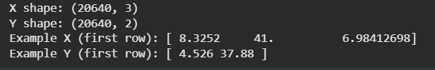
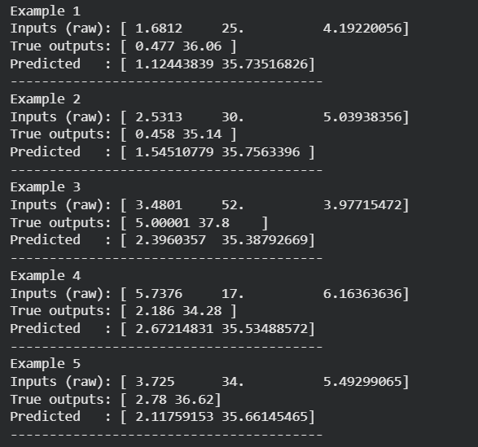
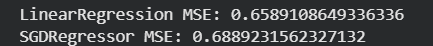

# SGD-Regressor-for-Multivariate-Linear-Regression

## AIM:
To write a program to predict the price of the house and number of occupants in the house with SGD regressor.

## Equipments Required:
1. Hardware – PCs
2. Anaconda – Python 3.7 Installation / Jupyter notebook

## Algorithm
1.Import the required library and read the dataframe

2.Write a function compute Cost to generate the cost function.

3.Perform iterations of gradient steps with learning rate.

4.Plot the Cost function using Gradient Descent and generate the required graph.

## Program:
```

Program to implement the multivariate linear regression model for predicting the price of the house and number of occupants in the house with SGD regressor.
Developed by: Kiruba RC
RegisterNumber: 212224230125 

```
```python
import numpy as np
from sklearn.datasets import fetch_california_housing
from sklearn.linear_model import SGDRegressor
from sklearn.multioutput import MultiOutputRegressor
from sklearn.model_selection import train_test_split
from sklearn.metrics import mean_squared_error
from sklearn.preprocessing import StandardScaler
# Code cell
data = fetch_california_housing()

# Select first 3 features (for demonstration)
X = data.data[:, :3]   # shape (n_samples, 3)

# Create a multi-output target: [median_house_value, some_other_numeric_column]
# Here we use column index 6 (for demonstration) as the second output
Y = np.column_stack((data.target, data.data[:, 6]))

print("X shape:", X.shape)
print("Y shape:", Y.shape)
print("Example X (first row):", X[0])
print("Example Y (first row):", Y[0])
# Code cell
X_train, X_test, Y_train, Y_test = train_test_split(X, Y, test_size=0.2, random_state=42)

print("Train shapes:", X_train.shape, Y_train.shape)
print("Test shapes: ", X_test.shape, Y_test.shape)
# Code cell
scaler_X = StandardScaler()
scaler_Y = StandardScaler()

# Fit on training data and transform both train and test
X_train_scaled = scaler_X.fit_transform(X_train)
X_test_scaled = scaler_X.transform(X_test)

Y_train_scaled = scaler_Y.fit_transform(Y_train)
Y_test_scaled = scaler_Y.transform(Y_test)

print("Scaled X_train mean (approx):", X_train_scaled.mean(axis=0))
print("Scaled Y_train mean (approx):", Y_train_scaled.mean(axis=0))
# Code cell
sgd = SGDRegressor(max_iter=1000, tol=1e-3, random_state=42)  # you can also set alpha, eta0, penalty etc.
multi_output_sgd = MultiOutputRegressor(sgd)

# Fit on scaled training data
multi_output_sgd.fit(X_train_scaled, Y_train_scaled)
# Code cell
Y_pred_scaled = multi_output_sgd.predict(X_test_scaled)   # predicted in scaled space
Y_pred = scaler_Y.inverse_transform(Y_pred_scaled)         # back to original units
Y_test_orig = scaler_Y.inverse_transform(Y_test_scaled)    # ground-truth back to original

print("First 5 predictions (original units):")
print(Y_pred[:5])
# Code cell
mse = mean_squared_error(Y_test_orig, Y_pred)
print("Mean Squared Error (multi-output):", mse)

# Per-output MSE (optional, helpful for debugging)
mse_per_output = np.mean((Y_test_orig - Y_pred) ** 2, axis=0)
print("MSE per output:", mse_per_output)
# Code cell
for i in range(5):
    print(f"Example {i+1}")
    print("Inputs (raw):", X_test[i])
    print("True outputs:", Y_test_orig[i])
    print("Predicted   :", Y_pred[i])
    print("-" * 40)
```
```python
from sklearn.linear_model import LinearRegression, SGDRegressor
from sklearn.metrics import mean_squared_error
import numpy as np
from sklearn.datasets import fetch_california_housing
from sklearn.model_selection import train_test_split
from sklearn.preprocessing import StandardScaler

# Load data
data = fetch_california_housing()
X, y = data.data[:, :3], data.target

# Train-test split
X_train, X_test, y_train, y_test = train_test_split(X, y, test_size=0.2, random_state=42)

# Scale features
scaler = StandardScaler()
X_train = scaler.fit_transform(X_train)
X_test = scaler.transform(X_test)

# Linear Regression
lr = LinearRegression()
lr.fit(X_train, y_train)
lr_pred = lr.predict(X_test)

# SGD Regressor
sgd = SGDRegressor(max_iter=1000, tol=1e-3, eta0=0.01, learning_rate='constant', random_state=42)
sgd.fit(X_train, y_train)
sgd_pred = sgd.predict(X_test)

# Compare
print("LinearRegression MSE:", mean_squared_error(y_test, lr_pred))
print("SGDRegressor MSE:", mean_squared_error(y_test, sgd_pred))
```

## Output:



```
Train shapes: (16512, 3) (16512, 2)
Test shapes:  (4128, 3) (4128, 2)
```
```
Scaled X_train mean (approx): [-6.59266865e-15 -6.68608149e-17  8.01559239e-15]
Scaled Y_train mean (approx): [1.92734502e-14 7.99652724e-14]
```
```
First 5 predictions (original units):
[[ 1.12443839 35.73516826]
 [ 1.54510779 35.7563396 ]
 [ 2.3960357  35.38792669]
 [ 2.67214831 35.53488572]
 [ 2.11759153 35.66145465]]

```
```
Mean Squared Error (multi-output): 2.5786797117742917
MSE per output: [0.66307497 4.49428445]
```




## Result:
Thus the program to implement the multivariate linear regression model for predicting the price of the house and number of occupants in the house with SGD regressor is written and verified using python programming.
